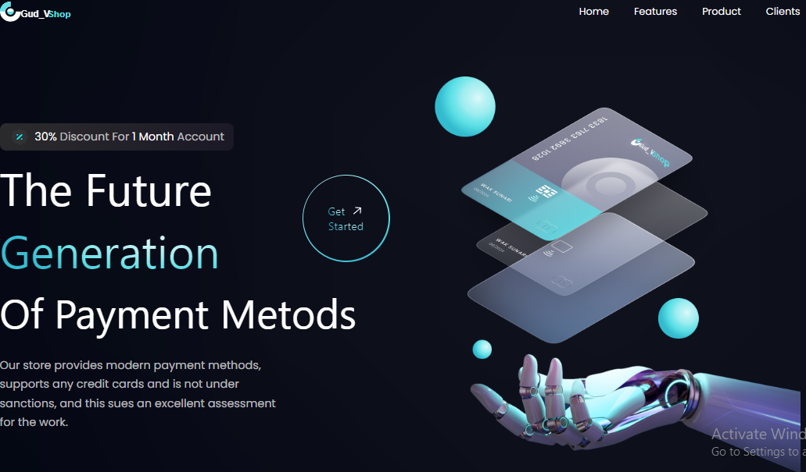

Welcome to this adventure called the Course project
# Course project
- [Hudov Uladzislau](https://github.com/Vladislavius12)

# Finally, the site is available at 
https://vladislavius12.github.io/Course_PJ_JS/

## My goals
- Ready
 <del>1. Make modern shop website</del>
- Ready
 <del>2. Make authorization page </del> 
- Working on somthing

Ps: Mainm - Is main section of market 

# Used libraries
1. Vite + React
2. Tailwind CSS

  
Screenshots

  
   - Project prototype:
   

   - Project working prototype:
   

   - Mobile version of site:
   

   - Screenshot of the work done:
     

