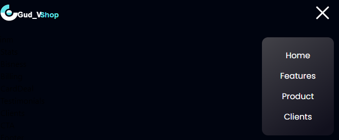

Welcome to this adventure called the Course project
# Course project
- [Hudov Uladzislau](https://github.com/Vladislavius12)

## My goals
1. Make modern shop website
2. Make authorization page  
3. If there is time, I will add products to the basket

Ps: Mainm - Is main section of market 

  
Screenshots

    - Project prototype:
    

    - Project working prototype:
    

    - Mobile version of site:
    

    - Screenshot of the work done:
      

